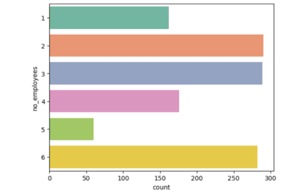
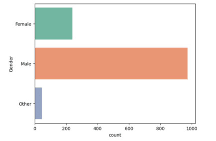

# Mental Health Prediction: Project Overview

Developed a machine learning model to predict mental health treatment based on survey data.

- Preprocessed data by handling missing values, encoding categorical variables, and scaling features.
- Conducted exploratory data analysis (EDA) to explore distributions and key insights.
- Built and evaluated multiple models, including Logistic Regression, K-Nearest Neighbors, Support Vector Machine (SVM), and Naive Bayes.
- Evaluated models using training accuracy, confusion matrix, and cross-validation scores.

## Code and Resources Used

- **Python Version:** 3.x
- **Packages:** pandas, numpy, sklearn, matplotlib, seaborn
- **Dataset:** Survey data uploaded via Google Colab.

## Data Preprocessing and Feature Engineering

After loading the data, I performed several preprocessing steps:

- Filled missing values for categorical features such as `state`, `work_interfere`, and `self_employed` using the most frequent values.
- Standardized gender categories by mapping various entries into 'Male', 'Female', or 'Other'.
- Converted categorical variables, such as `no_employees`, into numerical formats.
- Dropped irrelevant features, such as `Timestamp` and `comments`.

## EDA

Visualized the distributions of variables, including gender and number of employees. The key insights include:
  
  

## Model Building

The dataset was split into training and test sets with an 80-20 split. Four machine learning models were trained:

1. Logistic Regression
2. K-Nearest Neighbors
3. Support Vector Machine (SVM)
4. Naive Bayes

## Model Performance

Models were evaluated using accuracy on the training set, confusion matrix on the test set, and cross-validation scores:

- **Logistic Regression**: Testing Accuracy is 0.6865079365079365
- **K-Nearest Neighbors**: Testing Accuracy is 0.5555555555555556
- **Support Vector Machine (Linear Kernel)**: Testing Accuracy is 0.7222222222222222
- **Naive Bayes**: Testing Accuracy is 0.48412698412698413
